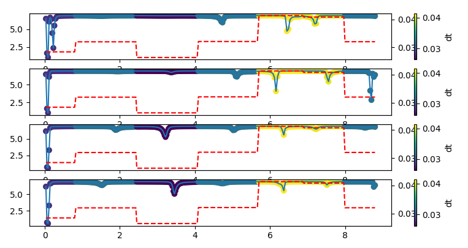
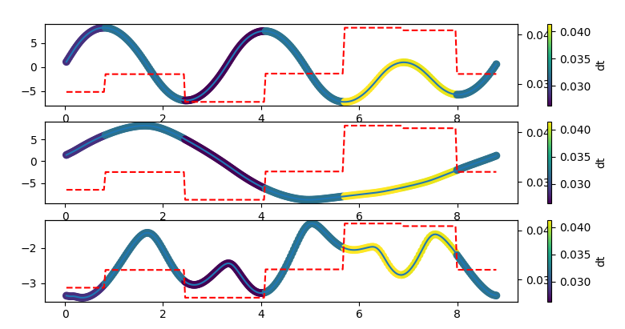

# fast_fly_recode

This is a rewrite of path planning and tracking library https://github.com/ZhouZiyuBIT/Fast-fly

## result





## time cost

### warmup nlp

```
Number of Iterations....: 74

                                   (scaled)                 (unscaled)
Objective...............:   7.0691778785691222e-03    1.2512023963384803e-02
Dual infeasibility......:   1.0261985695239832e-05    1.8163103706868670e-05
Constraint violation....:   0.0000000000000000e+00    0.0000000000000000e+00
Variable bound violation:   0.0000000000000000e+00    0.0000000000000000e+00
Complementarity.........:   5.1526460693785947e-06    9.1198767667669616e-06
Overall NLP error.......:   1.0261985695239832e-05    1.8163103706868670e-05


Number of objective function evaluations             = 187
Number of objective gradient evaluations             = 75
Number of equality constraint evaluations            = 0
Number of inequality constraint evaluations          = 0
Number of equality constraint Jacobian evaluations   = 0
Number of inequality constraint Jacobian evaluations = 0
Number of Lagrangian Hessian evaluations             = 74
Total seconds in IPOPT                               = 2.033

EXIT: Optimal Solution Found.
         opt  :   t_proc      (avg)   t_wall      (avg)    n_eval
       nlp_f  |  47.71ms (255.12us)  47.42ms (253.59us)       187
  nlp_grad_f  |  51.82ms (681.80us)  51.86ms (682.37us)        76
  nlp_hess_l  | 559.15ms (  7.56ms) 559.70ms (  7.56ms)        74
       total  |   2.03 s (  2.03 s)   2.03 s (  2.03 s)         1
```


### final npl

```
Number of Iterations....: 31

                                   (scaled)                 (unscaled)
Objective...............:   8.7994105526573261e+00    8.7994105526573261e+00
Dual infeasibility......:   1.6841896311194617e-05    1.6841896311194617e-05
Constraint violation....:   1.2806407297727418e-05    1.2806407297727418e-05
Variable bound violation:   0.0000000000000000e+00    0.0000000000000000e+00
Complementarity.........:   9.9317851441556337e-06    9.9317851441556337e-06
Overall NLP error.......:   1.6841896311194617e-05    1.6841896311194617e-05


Number of objective function evaluations             = 45
Number of objective gradient evaluations             = 32
Number of equality constraint evaluations            = 45
Number of inequality constraint evaluations          = 45
Number of equality constraint Jacobian evaluations   = 32
Number of inequality constraint Jacobian evaluations = 32
Number of Lagrangian Hessian evaluations             = 31
Total seconds in IPOPT                               = 0.929

EXIT: Optimal Solution Found.
         opt  :   t_proc      (avg)   t_wall      (avg)    n_eval
       nlp_f  | 163.00us (  3.62us) 140.53us (  3.12us)        45
       nlp_g  |  11.34ms (252.00us)  11.17ms (248.27us)        45
  nlp_grad_f  | 770.00us ( 23.33us) 762.70us ( 23.11us)        33
  nlp_hess_l  | 101.76ms (  3.28ms) 101.66ms (  3.28ms)        31
   nlp_jac_g  |  47.44ms (  1.44ms)  47.50ms (  1.44ms)        33
       total  | 929.91ms (929.91ms) 930.09ms (930.09ms)         1
```